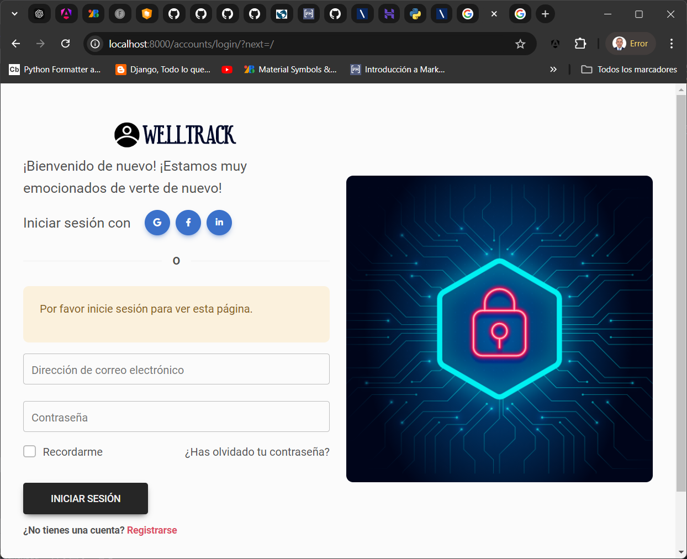

# Welltrack IA
Aplicación tecnológica, basada en DeepFace, que es un algoritmo CNN preentrenado para la detección y clasificación de emociones. El objetivo es proporcionar una solución que mejore el bienestar emocional de los trabajadores, facilitando a los departamentos de recursos humanos la toma de decisiones informadas a partir de los datos emocionales.

# Comenzando 🚀
_Estas instrucciones te permitirán obtener una copia del proyecto en funcionamiento en tu máquina local para propósitos de desarrollo y pruebas._

Mira Deployment para conocer como desplegar el proyecto.

## Pre-requisitos 📋
Asegúrate de tener instalado *Subsistema de Windows para Linux (WSL)* en tu máquina, también debe de tener la fecha y hora ajustada correctamente así como el Servidor Redis en ejecución. Puedes seguir esta guía para instalar y configurar los pre-requisitos.
* WSL2
* Python 3.10 
* Redis 7.2

## Instalación de la aplicación 🔧
Paso a seguidos para tener un entorno de desarrollo ejecutandose.
* Clonar el repositorio del proyecto  
  Para clonar el repositorio, use el siguiente comando::
  ```bash
  git clone https://github.com/jgracia/welltrack_ia.git
  cd welltrack_ia
* Crear un ambiente virtual de Python  
  Para crear un ambiente virtual, use el siguiente comando:
  ```bash
  python3 -m venv .venv
* Activar el entorno virtual  
  Una vez creado, active el entorno virtual con:
  ```bash
  source .venv/bin/activate
* Instalar las dependencias del proyecto  
  Con el entorno virtual activado, instale las dependencias necesarias:
  ```bash
  pip install -r requirements.txt
* Migrar la base de datos  
  Ejecute las migraciones de la base de datos con:
  ```bash
  python manage.py migrate

* Crear el usuario principal  
  Para crear un superusuario, use el siguiente comando y sigua las instrucciones:
  ```bash
  python manage.py createsuperuser
* Ejecutar el servidor de desarrollo  
  Inicia el servidor de desarrollo con:
  ```bash
  python manage.py createsuperuser
* Ejecutar Celery  
  En otra terminal, con el entorno virtual activado, ejecuta Celery con:
  ```bash
  celery -A welltrack_ia worker --loglevel=info
Una vez completada la guía de instalación, deberías tener tu entorno de prueba y desarrollo completamente configurado y en funcionamiento. 
Abre tu navegador y ve a la siguiente dirección para ver el proyecto en funcionamiento: http://127.0.0.1:8000
***
# Probando la aplicación ⚙️
_Para ejecutar las pruebas de la aplicación se debe de contar con videos previamente grabados o iniciar sesión con perfil de usuario de empleado, grabar y subir el video a analizar._

## Iniciar sesión 🔩
* Abrir el navegador  
  Abre tu navegador y ve a la siguiente dirección para ver el proyecto en funcionamiento:
  ```bash
  http://localhost:8000
* Iniciar sesión  
  En esta parte debes de colocar tu usuario y contraseña previamente creados en la instalación al momento de crear el superusuario:

  
  
***
# Despliegue 📦

Estas instrucciones te guiarán a través del proceso de despliegue de tu proyecto Django en un entorno de producción.

## Requisitos previos

Antes de comenzar, asegúrate de tener instalados los siguientes componentes en tu servidor de producción:
* Python 3.10
* Redis 7.2
* Docker (opcional, pero recomendado para simplificar el despliegue)

## Configuración del entorno

1. **Clonar el repositorio del proyecto**  
   Clona el repositorio en tu servidor de producción:
   ```bash
   git clone https://github.com/jgracia/welltrack_ia.git
   cd welltrack_ia
### 2. Crear y activar un entorno virtual
* Abre tu navegador y ve a la siguiente dirección para ver el proyecto en funcionamiento:
  ```bash
  python3 -m venv .venv
  source .venv/bin/activate
### 3. Instalar las dependencias del proyecto
* Instala las dependencias necesarias:
  ```bash
  pip install -r requirements.txt
### 4. Configurar las variables de entorno
* Crea un archivo .env en el directorio raíz del proyecto y define las variables de entorno necesarias como configuraciones de base de datos, claves secretas, etc.
### 5. Migrar la base de datos
* Ejecuta las migraciones de la base de datos:
  ```bash
  python manage.py migrate
### 6. Crear un superusuario
* Crea un superusuario para acceder al panel de administración:
  ```bash
  python manage.py createsuperuser
## Configuración de Redis y Celery
### 1. Iniciar el servidor de Redis
* Asegúrate de que Redis esté en ejecución:
  ```bash
  redis-server
### 2. Configurar y ejecutar Celery
* En otra terminal, con el entorno virtual activado, ejecuta Celery:
  ```bash
  celery -A welltrack_ia worker --loglevel=info
## Configuración del servidor web
### 1. Configurar Gunicorn
* Utiliza Gunicorn para servir tu aplicación Django:
  ```bash
  gunicorn welltrack_ia.wsgi:application --bind 0.0.0.0:8000
### 2. Configurar Nginx
* Configura Nginx como proxy inverso para Gunicorn. Aquí tienes un ejemplo de configuración para Nginx:
  ```bash
  server {
    listen 80;
    server_name tu_dominio.com;

    location / {
        proxy_pass http://127.0.0.1:8000;
        proxy_set_header Host $host;
        proxy_set_header X-Real-IP $remote_addr;
        proxy_set_header X-Forwarded-For $proxy_add_x_forwarded_for;
        proxy_set_header X-Forwarded-Proto $scheme;
    }

    location /static/ {
        alias /ruta/a/tu/proyecto/static/;
    }

    location /media/ {
        alias /ruta/a/tu/proyecto/media/;
    }
}
### 3. Reiniciar Nginx
* Reinicia Nginx para aplicar los cambios:
  ```bash
  sudo systemctl restart nginx
## Verificar el despliegue
* Abre tu navegador y ve a la dirección de tu servidor para verificar que el proyecto esté funcionando correctamente:
  ```bash
  http://tu_dominio.com
***

# Contribuyendo 🖇️

Si deseas contribuir a este proyecto, por favor sigue los siguientes pasos:

1. Haz un fork del repositorio.
2. Crea una nueva rama (`git checkout -b feature/nueva-funcionalidad`).
3. Realiza tus cambios y haz commit (`git commit -m 'Añadir nueva funcionalidad'`).
4. Sube tus cambios a tu rama (`git push origin feature/nueva-funcionalidad`).
5. Abre un Pull Request.

Por favor, asegúrate de que tu código sigue los estándares de estilo del proyecto y que todas las pruebas pasan antes de enviar tu Pull Request. También puedes revisar la guía de contribución para más detalles.

# Wiki 📖

Para más información sobre cómo utilizar este proyecto, puedes visitar nuestra Wiki. En la Wiki, encontrarás:

* **Guías de usuario**: Instrucciones detalladas sobre cómo utilizar las diferentes funcionalidades de la aplicación.
* **Documentación técnica**: Información sobre la arquitectura del proyecto, las tecnologías utilizadas y cómo se integran.
* **Preguntas frecuentes (FAQ)**: Respuestas a las preguntas más comunes sobre el uso y desarrollo del proyecto.
* **Ejemplos y tutoriales**: Ejemplos prácticos y tutoriales paso a paso para ayudarte a empezar rápidamente.

Si tienes alguna pregunta o necesitas más información, no dudes en consultar la Wiki o abrir un issue en el repositorio.

# Autores ✒️
* Javier Isaías Gracia Moreira
* Washington Gregorio Andrade Muñoz

# Licencia 📄
Este proyecto está bajo la Licencia MIT - mira el archivo LICENSE para más detalles.

# Expresiones de Gratitud 🎁
* Agradecimientos especiales a nuestros mentores y profesores.
* Gracias a la comunidad de código abierto por sus valiosas herramientas y recursos.
* Si te gustó este proyecto, ¡considera darle una estrella en GitHub!
